# Grafana

Grafana is an open-source platform for visualizing and exploring time-series data (and more).

It connects to many data sources—Prometheus, Loki, Tempo, Elasticsearch, InfluxDB, PostgreSQL, ClickHouse, CloudWatch,
etc.—and lets you build interactive dashboards, set alerts, and share reports.

**How it fits with Prometheus**

* Prometheus scrapes/stores metrics; Grafana queries and visualizes them with PromQL.
* Common stack: Prometheus (metrics) + Loki (logs) + Tempo (traces) + Grafana → one UI to pivot between signals.

## How does Grafana get data to display?

1. You add Prometheus as a data source in Grafana

2. A dashboard panel runs a PromQL query

    1. Example: `rate(http_requests_total[5m])`
    2. Each time the panel refreshes (e.g. every 5s / 15s / 1m based on dashboard settings), Grafana sends this query to
       Prometheus.

3. Grafana sends an HTTP request to the Prometheus API
    1. Request example: `GET /api/v1/query?query=rate(http_requests_total%5B5m%5D)`
    2. Prometheus returns a JSON response:
   ```json
   {
    "status": "success",
    "data": {
      "resultType": "vector",
      "result": [
        {
          "metric": {
            "job": "api",
            "instance": "host1"
          },
          "value": [ 1718912000.123, "12.5" ]
        }
      ]
    }
   }
   ```
   3. Grafana takes this JSON and plots it.

4. Grafana applies transformations / display logic
   * Grafana does:
     * graphing
     * color mapping
     * thresholds
     * joining/multiplying results (optional)
     * panel calculations
   * But no data storage.

5. For time ranges, Grafana uses /api/v1/query_range
   * Example: `GET /api/v1/query_range?query=node_load1&start=...&end=...&step=30s`
   * Prometheus returns multiple samples per series, and Grafana renders the graph.

## What does Grafana not do?

Grafana does not:
* scrape targets
* store metrics
* run exporters
* ingest data
* evaluate recording rules
* enforce retention

All of that is Prometheus’s job.

Grafana is strictly a visualization + query interface.

## Configuration

You will find a `grafana.ini` file in `/etc/grafana`, in which you can configure different aspects.

It's recommended to create a copy when editing it - for example, `custom.ini`.

If you want to keep your data in an external database, then you can configure that in the `.ini` file.

## Example

Run the docker compose file in `chapters/Grafana/examples/docker-compose.yml`:

```bash
docker compose up -d
```

Push a sample metric for Pushgateway:

```bash
echo "demo_job_duration_seconds 2.5" | curl --data-binary @- http://localhost:9091/metrics/job/demo/instance/local
```

Or use the Node helper.

```bash
node ./helpers/pushData.js
```

Query with: `demo_job_duration_seconds{job="demo",instance="local"}`

## Creating visualizations

Grafana has 3 levels of hierarchy:
* Folders
  * Top-level grouping.
  * A dashboard must belong to exactly one folder.
  * Folders are used for organization and permissions.
  * Grafana does not support nested folders (only one level).
* Dashboards
  * Each folder contains dashboards.
  * A dashboard is made up of rows and panels.
  * Dashboards don’t contain dashboards; there is no deeper nesting.
* Panels and visualizations
  * Inside a dashboard you have panels.
  * A panel = visualization + query + settings.
  * Panels may optionally be arranged into rows, but rows are purely visual layout helpers — they are not a grouping level for navigation or organization.

### Disjointed null values

If you have event driven metrics, then you might see that values are disconnected.

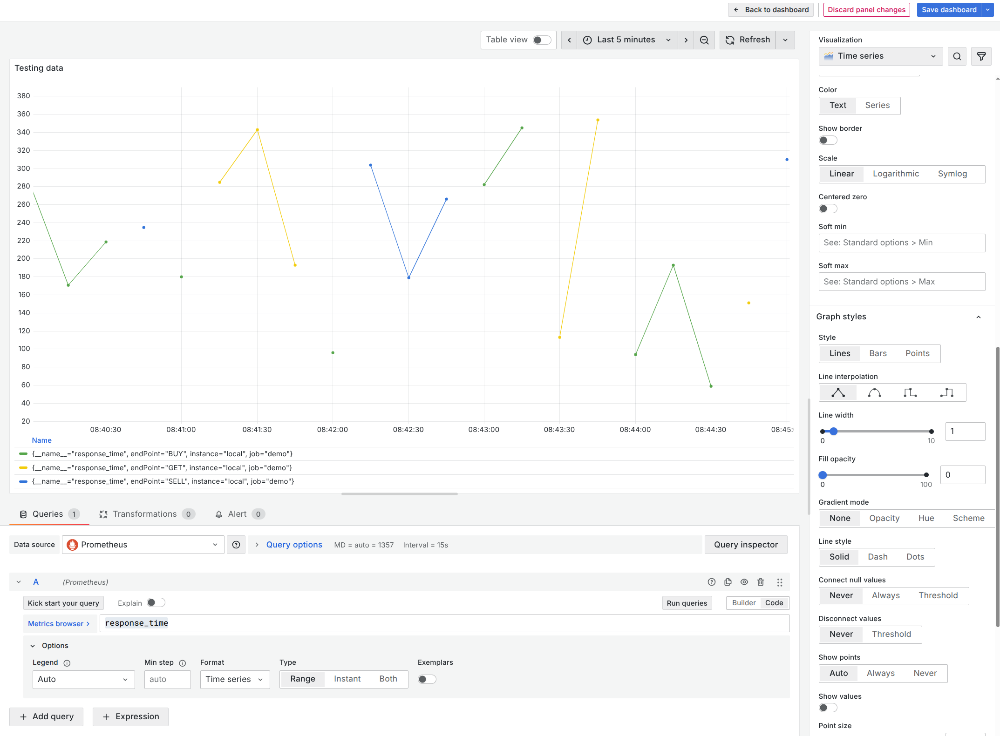

In order to fix it, you can refer to the "Connect null values" option.
This'll allow you to connect them.

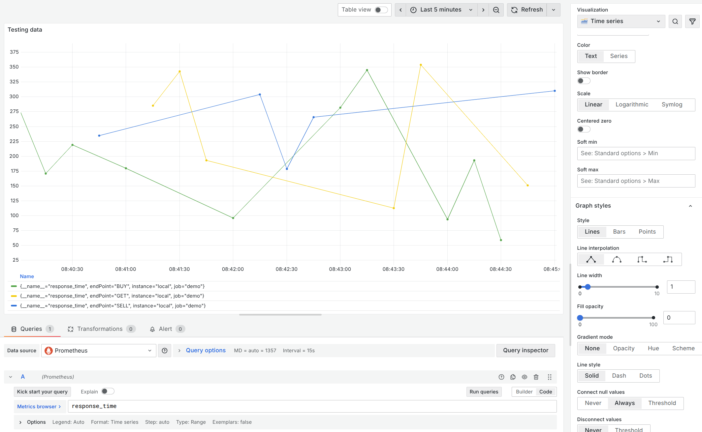

### Custom labels

When assigning custom labels, you can use the label values in the template.

The example metric that's being shown a label for is `response_time{endPoint="BUY", instance="local", job="demo"}`

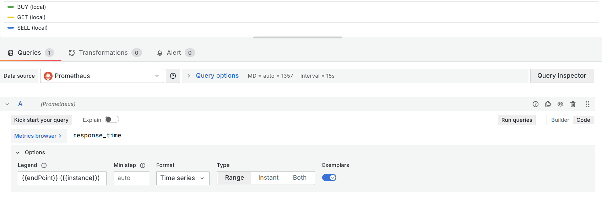

### Data transformations

You can perform data transformations on queries.

However, this should only be used if the calculation cannot be done in the system itself.

This is because a bunch of knowledge won't be forwarded to Grafana, so its calculations might be inaccurate.

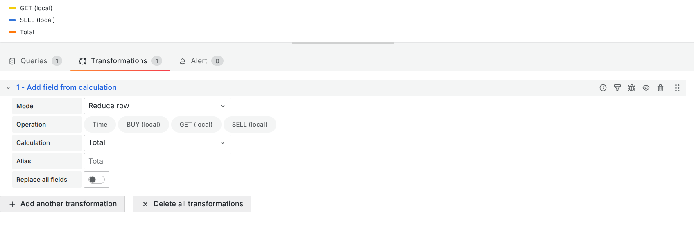

### Passing variables in the PromQL query

You can pass Grafana parameters into the query that you're adding to the panel.

This is done using the `$` prefix.

For example, there are several global variables you can use, if you want to pass in a range from Grafana - `$__range`.

Example query:
```
sum (
    sum_over_time(product_sold{product="gloves"}[$__range]) # Gets all of the products sold over the last N time
) by (region) # Sums it all up by region
```

The `$__range` value comes from the "Last 24 hours" from above.

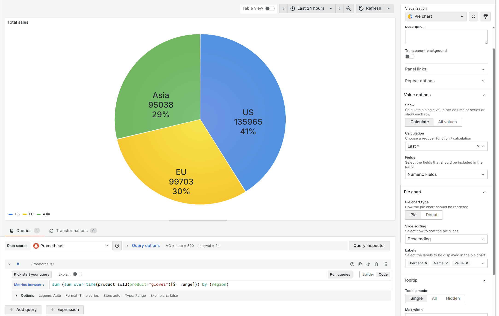

### Threshold

You can add a threshold to signify values that are too high/low.


### Custom variables

Grafana allows you to attach variables to a dashboard, and then utilize them in your panels.

Grafana allows you to use some helper functions as well, for example `label_values` to get the list of available label values for a metric.

```
label_values(<metric name>, <metric label>)
```
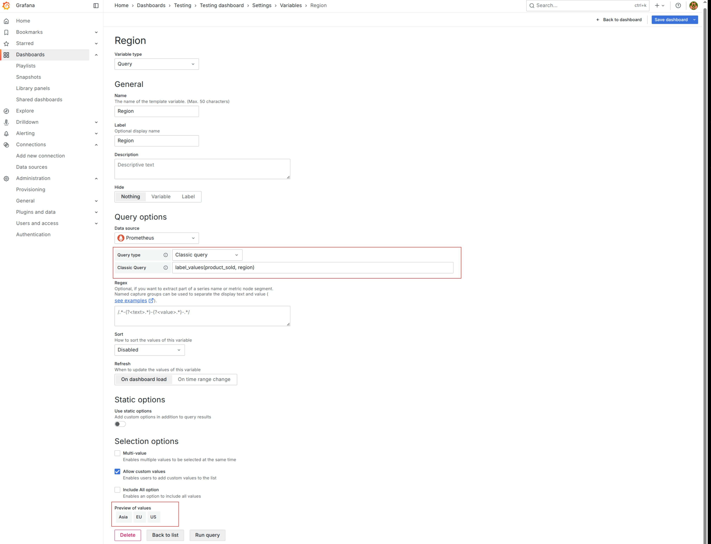

To actually use that variable, you'd use the variable name prefixed with `$`.

So for example in Grafana text: `Item sales for $Region`

And in a query: `product_sold{region=~"$Region"}`

The regex operator is there to enable multiple values.

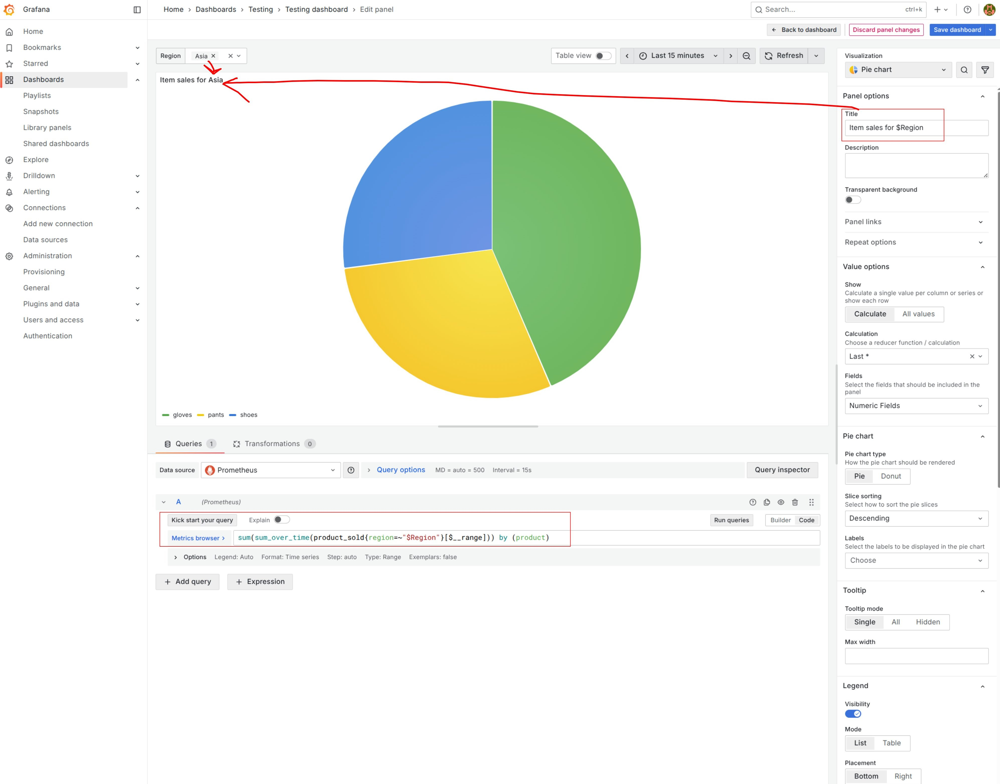

If the dashboard is not editable, so just on a display, then you could repeat the dashboards.

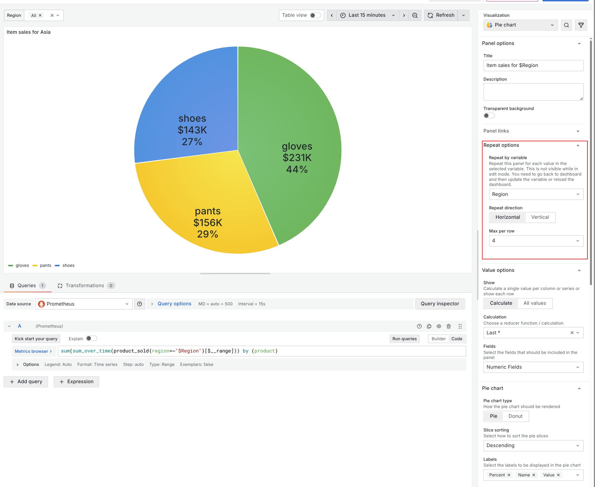

So when you make choices in the variables, then it'd be repeated based on that.

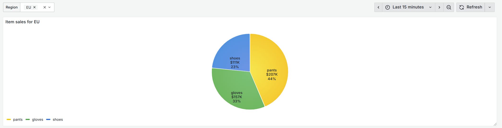

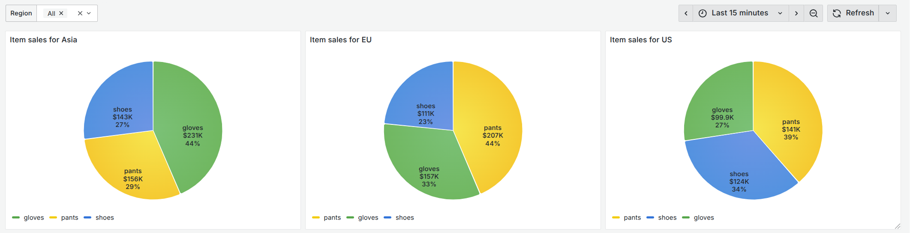

### Scale

If you have values that are wildly different in terms of scale, then linear comparison might not be the best.

For example, this graph uses 0, 2, 500.

With linear comparison, it looks like this:

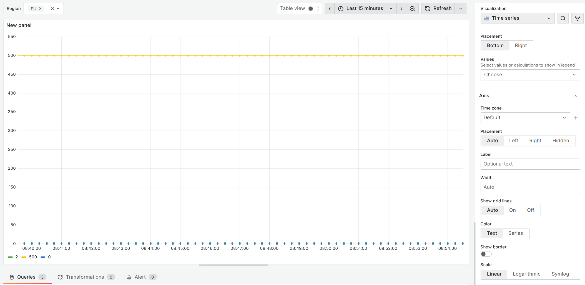

The 0, and 2 values are barely visible.

However, switching to logarithmic with base 10 makes the small values more visible.

Currently, 2 and 10 are available bases to use.

Do note that the 0 value disappears. Also, any negative values would disappear.

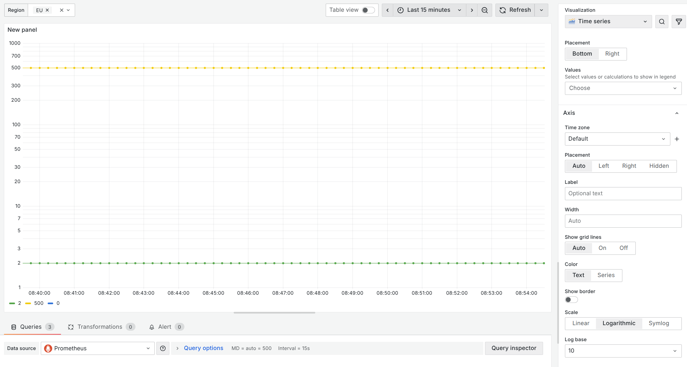

In order to avoid the 0 and negative values disappearing, use Symlog.
However, this comes with configuration overhead.

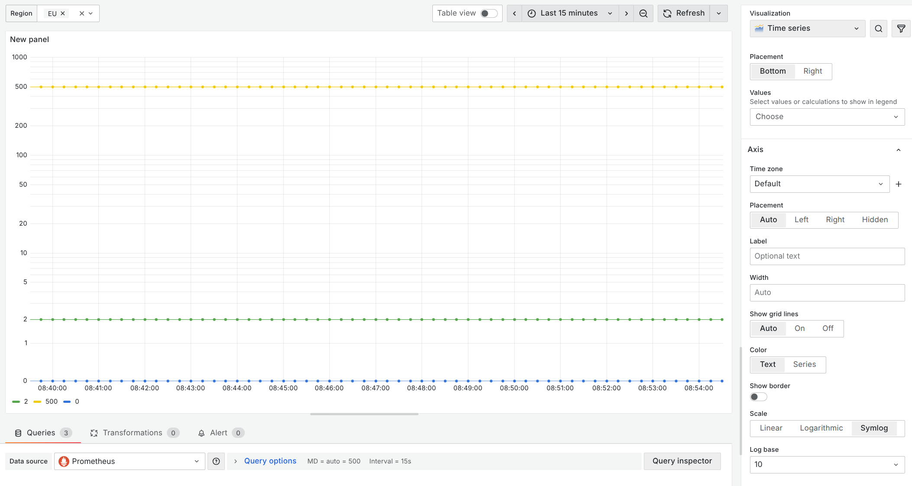