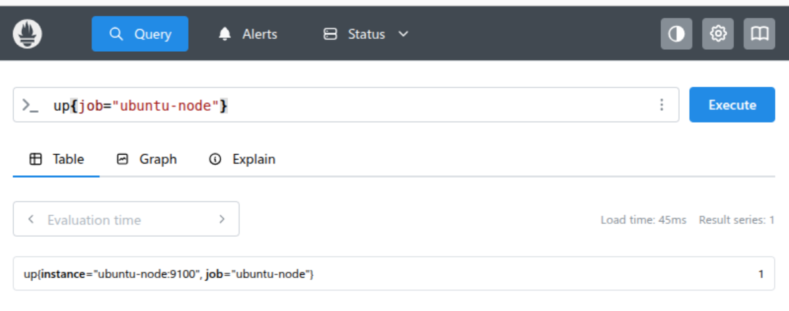
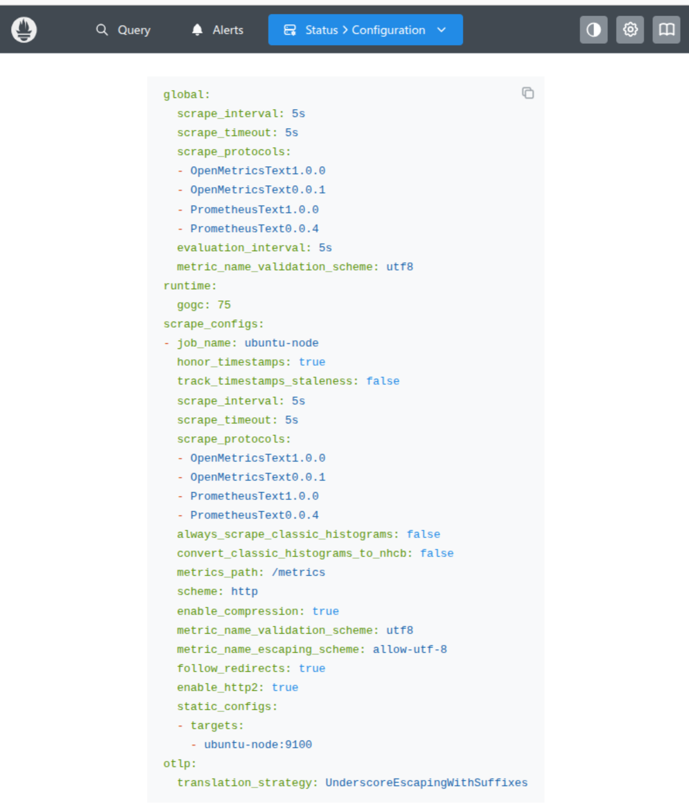
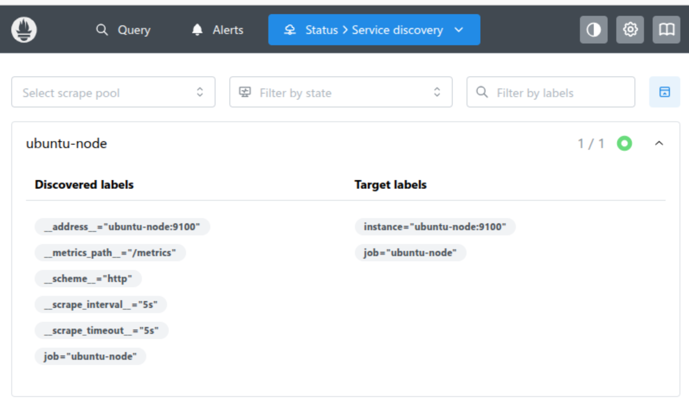

# Prometheus

Prometheus is an open-source monitoring and time-series database built for cloud-native systems.

**What it does**
* Scrapes metrics from targets over HTTP (pull model) at intervals. 
* Stores them as time series: metric_name{label="value", ...} -> samples over time. 
* Lets you query with PromQL (e.g., rates, sums, percentiles). 
* Generates alerts (Prometheus → Alertmanager) and recording rules (precomputed series).

**Core pieces**
* Prometheus server - scraping, TSDB, PromQL engine.
* Exporters - expose /metrics (e.g., node_exporter, app SDKs).
* Alertmanager - dedup/route/notify on alert rules.
* Pushgateway (optional) - for short-lived jobs to push metrics.
* Service discovery - finds targets (Kubernetes, EC2, files, etc.).

**What it’s not**
* Not a log store or tracing system (pair with Loki/Elastic; Tempo/Jaeger/OTel for traces).

Use Prometheus to observe service health, latency, throughput, errors, and trigger alerts when SLOs are at risk.

## Operating Prometheus

You can run Prometheus with Docker using:

```bash
docker run --name prometheus -d -p 127.0.0.1:9090:9090 prom/prometheus
```

### Collecting data and metrics

When we have the source code of the application, then we can send the metrics easily.

However, if we do not have it, then we need an exporter. For example, we want metrics out of MySQL.

Or if there are so many devices they could accidentally DDOS your Prometheus.

The process of Prometheus pulling in the metrics, as opposed to them being sent to it, is called scraping/pulling.

Prometheus has a configurable property, so that every N seconds it'll pull the data.

If data is pushed to Prometheus, then it'll hit the Push Gateway, which acts as temporary storage, which has a built-in exporter.

So regardless of how data is being sent, then Prometheus will always pull.

### Node exporter (Linux)

Node Exporter is an official Prometheus exporter for collecting metrics that are exposed by Unix-based kernels. E.g. Linux and Ubuntu.

Example of metrics are CPU, Disk, Memory, and Network I/O.

Node Exporter can be extended with pluggable metric collectors.

Run the example:
```bash
docker compose up --build -d
```

Validate in the Prometheus query that data is coming through:
```
up{job="ubuntu-node"}
```



In order to see the shape of the data that is actually being exported:
```bash
docker compose exec ubuntu-node sh -lc 'curl -s http://localhost:9100/metrics | head -n 40'
```

Example snippet of the data:
```
# HELP go_gc_duration_seconds A summary of the wall-time pause (stop-the-world) duration in garbage collection cycles.
# TYPE go_gc_duration_seconds summary
go_gc_duration_seconds{quantile="0"} 1.683e-05
go_gc_duration_seconds{quantile="0.25"} 3.0344e-05
go_gc_duration_seconds{quantile="0.5"} 3.845e-05
go_gc_duration_seconds{quantile="0.75"} 5.3504e-05
go_gc_duration_seconds{quantile="1"} 0.000572157
go_gc_duration_seconds_sum 0.004976475
go_gc_duration_seconds_count 104
```

Lines starting with # HELP/# TYPE are metadata.

Each metric line is name{label="value",...} number.
* However, the labels that are added will be in addition to default ones.
* Prometheus itself will add a bunch of labels by default.
* So in the above example, it doesn't mean that `go_gc_duration_seconds_count` has no properties to filter on. 

To see the entire configuration of your Prometheus instance, you can go into Status -> Configuration.

Notice, that there are a lot more properties there than are listed in our file.

This is because our file allows for partial overriding, while the defaults remain.



You can check what kind of scrapers are defined in the above, or by going to Status -> Service discovery.



### Data model

Prometheus stores data as time series.

A time series is uniquely identified by:
* a metric name (e.g., http_requests_total)
* a set of labels (key–value strings), e.g. {method="GET", handler="/api", job="api", instance="10.0.0.5:8080"}

So this pair identifies one series:
```
http_requests_total{method="GET", handler="/api", job="api", instance="10.0.0.5:8080"}
```

In a more generic form, it's:
```
<metric name>{key=value,key=value,...}
```

High-cardinality labels (e.g., user IDs) explode the number of series—avoid them.

#### Data types in PromQL

PromQL expressions evaluate to one of four types:
* Instant vector - returns the most recent sample for every time series that matches the selector. Defaults to now.
  * An example query: `go_gc_duration_seconds{quantile="0.5"}`
  * Results in:
  ```
  {job="node", instance="ubuntu-node:9100", quantile="0.5"} 3.845e-05
  {job="node", instance="api-1:9100",       quantile="0.5"} 4.210e-05
  ```
  * If multiple targets expose this metric (each Go process), you’ll get multiple series, one per target.
  * To change the time you want to look at use the `@` operator - `go_gc_duration_seconds{quantile="0.5"} @ 1730808000`
* Range vector - for each matching series, a time window of samples.
  * `go_gc_duration_seconds{quantile="0.5"}[5m]`
  * The above returns every single data point that Prometheus has over the latest 5 minutes.
* Scalar - a single number.
* String - rarely used (e.g., label_join returns vectors, not strings).

Remember, the amount of data points that you have is dependent on your scrape interval.
Each scrape produces one data point.

#### Operators in PromQL

Most math/aggregation operators work on instant vectors; functions like `rate()` require range vectors.

If you perform an operation on an instant vector, then each data point will get that result.

Let's look at `go_gc_duration_seconds` as an example.

```
go_gc_duration_seconds
->
go_gc_duration_seconds{instance="ubuntu-node:9100", job="ubuntu-node", quantile="0.0"}	0.000019201
go_gc_duration_seconds{instance="ubuntu-node:9100", job="ubuntu-node", quantile="0.25"}	0.000034546
go_gc_duration_seconds{instance="ubuntu-node:9100", job="ubuntu-node", quantile="0.5"}	0.00003997
go_gc_duration_seconds{instance="ubuntu-node:9100", job="ubuntu-node", quantile="0.75"}	0.000054809
go_gc_duration_seconds{instance="ubuntu-node:9100", job="ubuntu-node", quantile="1.0"}	0.000205836
```

For example:
* Executing `go_gc_duration_seconds{quantile="0.5"}` will result in `0.00003997`
* But executing `go_gc_duration_seconds{quantile="0.5"} + 10` will result in `10.00003997`

You can also add instant vectors with the same labels together:
* Executing `go_gc_duration_seconds{quantile="0.5"}` will result in `0.00003997`
* But executing `go_gc_duration_seconds{quantile="0.5"} + go_gc_duration_seconds{quantile="0.5"}` will result in `0.00007994`
* If the labels differ, then they won't show up in the result.
* For example: `go_gc_duration_seconds{quantile="0.5"} + go_gc_duration_seconds{quantile="0.25"}` results in nothing.

You can apply comparison operators on results as well. By default, it'll filter the results. 

Running this:
```
go_gc_duration_seconds < 0.000054809
```

Results in
```
go_gc_duration_seconds{instance="ubuntu-node:9100", job="ubuntu-node", quantile="0.0"}	0.000019201
go_gc_duration_seconds{instance="ubuntu-node:9100", job="ubuntu-node", quantile="0.25"}	0.000034546
go_gc_duration_seconds{instance="ubuntu-node:9100", job="ubuntu-node", quantile="0.5"}	0.00003997
```

Running this:
```
go_gc_duration_seconds > 0.000054809
```

Results in
```
go_gc_duration_seconds{instance="ubuntu-node:9100", job="ubuntu-node", quantile="1.0"}	0.000205836
```

There are 3 binary operators available as well:
* `and`
  * Returns the overlapping instant vectors with the same labels
  * For example, running `go_gc_duration_seconds >= 0.000054809 and go_gc_duration_seconds <= 0.000054809`
  * Results in:
  ```
  go_gc_duration_seconds{instance="ubuntu-node:9100", job="ubuntu-node", quantile="0.75"}	0.000054809
  ```
* `or`
  * Returns all the instant vectors
  * For example, running `go_gc_duration_seconds >= 0.000054809 or go_gc_duration_seconds <= 0.000054809`
  * Results in:
  ```
    go_gc_duration_seconds{instance="ubuntu-node:9100", job="ubuntu-node", quantile="0.75"}	0.000054809
    go_gc_duration_seconds{instance="ubuntu-node:9100", job="ubuntu-node", quantile="1.0"}	0.000205836
    go_gc_duration_seconds{instance="ubuntu-node:9100", job="ubuntu-node", quantile="0.0"}	0.000019201
    go_gc_duration_seconds{instance="ubuntu-node:9100", job="ubuntu-node", quantile="0.25"}	0.000034546
    go_gc_duration_seconds{instance="ubuntu-node:9100", job="ubuntu-node", quantile="0.5"}	0.00003997
  ```
* `unless`
  * Returns the instant vectors from the left-hand side that do not have matching labels on the right-hand side
  * For example, running `go_gc_duration_seconds >= 0.000054809 unless go_gc_duration_seconds <= 0.000054809`
  * Returns:
  ```
  go_gc_duration_seconds{instance="ubuntu-node:9100", job="ubuntu-node", quantile="1.0"}	0.000205836
  ```
  * Looking at the results separately:
  ```
  go_gc_duration_seconds >= 0.000054809
  ->
  go_gc_duration_seconds{instance="ubuntu-node:9100", job="ubuntu-node", quantile="0.75"}	0.000054809
  go_gc_duration_seconds{instance="ubuntu-node:9100", job="ubuntu-node", quantile="1.0"}	0.000205836

  go_gc_duration_seconds <= 0.000054809
  ->
  go_gc_duration_seconds{instance="ubuntu-node:9100", job="ubuntu-node", quantile="0.0"}	0.000019201
  go_gc_duration_seconds{instance="ubuntu-node:9100", job="ubuntu-node", quantile="0.25"}	0.000034546
  go_gc_duration_seconds{instance="ubuntu-node:9100", job="ubuntu-node", quantile="0.5"}	0.00003997
  go_gc_duration_seconds{instance="ubuntu-node:9100", job="ubuntu-node", quantile="0.75"}	0.000054809
  ```

The matchers that can be used are:
* Equal (=) - two values must be equal.
  * `go_gc_duration_seconds{quantile="0.5"}` - returns all where quantile label is 0.5.
* Not equal (!=) - two values most NOT be equal.
* `go_gc_duration_seconds{quantile!="0.5"}` - returns all where quantile label is NOT 0.5.
* Regexp match (=~) - value on the left must match the regex on the right.
  * `go_gc_duration_seconds{quantile=~"0.*"}` - returns all where quantile label starts with 0.
* Regexp not match (!~) - value on the left must NOT match the regex on the right.
  * `go_gc_duration_seconds{quantile!~"0.*"}` - returns all where quantile label does NOT start with 0.

Aggregation operators can be used to aggregate values from instant vectors into a new instant vector with aggregated values.

Let's look at a larger set as an example:
```
node_cpu_seconds_total{cpu="0"} or node_cpu_seconds_total{cpu="1"}
-> 

node_cpu_seconds_total{cpu="0", instance="ubuntu-node:9100", job="ubuntu-node", mode="idle"}	119010.49
node_cpu_seconds_total{cpu="0", instance="ubuntu-node:9100", job="ubuntu-node", mode="iowait"}	208.58
node_cpu_seconds_total{cpu="0", instance="ubuntu-node:9100", job="ubuntu-node", mode="irq"}	    0
node_cpu_seconds_total{cpu="0", instance="ubuntu-node:9100", job="ubuntu-node", mode="nice"}	15.8
node_cpu_seconds_total{cpu="0", instance="ubuntu-node:9100", job="ubuntu-node", mode="softirq"}	170.32
node_cpu_seconds_total{cpu="0", instance="ubuntu-node:9100", job="ubuntu-node", mode="steal"}	0
node_cpu_seconds_total{cpu="0", instance="ubuntu-node:9100", job="ubuntu-node", mode="system"}	3088.22
node_cpu_seconds_total{cpu="0", instance="ubuntu-node:9100", job="ubuntu-node", mode="user"}	35629.7
node_cpu_seconds_total{cpu="1", instance="ubuntu-node:9100", job="ubuntu-node", mode="idle"}	133491.21
node_cpu_seconds_total{cpu="1", instance="ubuntu-node:9100", job="ubuntu-node", mode="iowait"}	74.3
node_cpu_seconds_total{cpu="1", instance="ubuntu-node:9100", job="ubuntu-node", mode="irq"}	    0
node_cpu_seconds_total{cpu="1", instance="ubuntu-node:9100", job="ubuntu-node", mode="nice"}	18.25
node_cpu_seconds_total{cpu="1", instance="ubuntu-node:9100", job="ubuntu-node", mode="softirq"}	152.02
node_cpu_seconds_total{cpu="1", instance="ubuntu-node:9100", job="ubuntu-node", mode="steal"}	0
node_cpu_seconds_total{cpu="1", instance="ubuntu-node:9100", job="ubuntu-node", mode="system"}	1698.15
node_cpu_seconds_total{cpu="1", instance="ubuntu-node:9100", job="ubuntu-node", mode="user"}	25659.25
```

Some operators that are available:
* sum - sum of the values
  * Example: `sum(node_cpu_seconds_total{cpu="0"})`
  * Results in: `{}	158123.11000000002`
* min - smallest value
  * Example: `min(node_cpu_seconds_total{cpu="0"})`
  * Results in: `{}	0`
* max - largest value
  * Example: `max(node_cpu_seconds_total{cpu="0"})`
  * Results in: `{}	119010.49`
* avg - average value
  * Example: `avg(node_cpu_seconds_total{cpu="0"})`
  * Results in: `{}	19765.388750000002`
* count - number of elements
  * Example: `count(node_cpu_seconds_total{cpu="0"})`
  * Results in: `{}	8`
* group - groups values. Returns 1 for each unique value.
  * Example: `group(node_cpu_seconds_total{cpu="0"} or node_cpu_seconds_total{cpu="1"}) by (mode)`
  * Results in:
  ```
  {mode="idle"}     1
  {mode="iowait"}   1
  {mode="irq"}      1
  {mode="nice"}     1
  {mode="softirq"}  1
  {mode="steal"}    1
  {mode="system"}   1
  {mode="user"}     1
  ```
* count_values - counts values with the same values
  * Example: `count_values("some_custom_label_i_want", node_cpu_seconds_total{cpu="0"} or node_cpu_seconds_total{cpu="1"}) by (mode)`
  * Results in:
  ```
  {mode="user", some_custom_label_i_want="35629.7"}     1
  {mode="idle", some_custom_label_i_want="133491.21"}   1
  {mode="irq", some_custom_label_i_want="0"}            2
  {mode="iowait", some_custom_label_i_want="74.3"}      1
  {mode="nice", some_custom_label_i_want="18.25"}       1
  {mode="softirq", some_custom_label_i_want="152.02"}   1
  {mode="system", some_custom_label_i_want="1698.15"}   1
  {mode="user", some_custom_label_i_want="25659.25"}    1
  {mode="idle", some_custom_label_i_want="119010.49"}   1
  {mode="iowait", some_custom_label_i_want="208.58"}    1
  {mode="nice", some_custom_label_i_want="15.8"}        1
  {mode="softirq", some_custom_label_i_want="170.32"}   1
  {mode="steal", some_custom_label_i_want="0"}          2
  {mode="system", some_custom_label_i_want="3088.22"}   1
  ```
  * Notice that the custom label that's provided contains the value that's being counted
* topk - N largest elements
  * Example: `topk(3, node_cpu_seconds_total{cpu="0"} or node_cpu_seconds_total{cpu="1"})`
  * Results in:
  ```
  node_cpu_seconds_total{cpu="1", instance="ubuntu-node:9100", job="ubuntu-node", mode="idle"}	133491.21
  node_cpu_seconds_total{cpu="0", instance="ubuntu-node:9100", job="ubuntu-node", mode="idle"}	119010.49
  node_cpu_seconds_total{cpu="0", instance="ubuntu-node:9100", job="ubuntu-node", mode="user"}	35629.7
  ```
* bottomk - N smallest elements
    * Example: `bottomk(3, node_cpu_seconds_total{cpu="0"} or node_cpu_seconds_total{cpu="1"})`
    * Results in:
    ```
    node_cpu_seconds_total{cpu="1", instance="ubuntu-node:9100", job="ubuntu-node", mode="irq"}     0
    node_cpu_seconds_total{cpu="0", instance="ubuntu-node:9100", job="ubuntu-node", mode="steal"}   0
    node_cpu_seconds_total{cpu="0", instance="ubuntu-node:9100", job="ubuntu-node", mode="irq"}     0
    ```
* stddev - standard deviation. High value means that values are dispersed. Low means that they're clustered.
  * Example: `stddev(node_cpu_seconds_total{cpu="0"})`
  * Results in: `{}	39238.401756997395`, which indicates a large variation.
  * Example: `stddev(node_cpu_seconds_total{cpu="0"} < 1)`
  * Results in: `{}	0`, which means that they're all the same value.
* stdvar - standard variation
  * Sibling operator `stddev` returns the standard deviation; `stdvar` is its square.
* quantile - calculate φ-quantile (0 ≤ φ ≤ 1) over dimensions

Also, the above operators have corresponding range operators with `<aggregation>_over_time()` functions.

There are 3 basic forms for the operation:
* `<Aggregation Operator>(<Instant vector>)` - the most basic form
  * `sum(node_cpu_seconds_total)`
  * Running: `sum(node_cpu_seconds_total{cpu="0"} or node_cpu_seconds_total{cpu="1"})`
  * Results in: `{}	319216.29`
* `<Aggregation Operator>(<Instant vector>) by (<Label list>)` - group by label
  * `sum(node_cpu_seconds_total) by (http_code)`
  * Running: `sum(node_cpu_seconds_total{cpu="0"} or node_cpu_seconds_total{cpu="1"}) by (mode)`
  * Results in:
  ```
  {mode="idle"}     252501.7
  {mode="iowait"}   282.88
  {mode="irq"}      0
  {mode="nice"}     34.05
  {mode="softirq"}  322.34000000000003
  {mode="steal"}    0
  {mode="system"}   4786.37
  {mode="user"}     61288.95
  ```
* `<Aggregation Operator>(<Instant vector>) without (<Label list>)` - group ignoring that label
  * `sum(node_cpu_seconds_total) without (http_code)`
  * Running: `sum(node_cpu_seconds_total{cpu="0"} or node_cpu_seconds_total{cpu="1"}) without (mode)`
  * Results in:
  ```
  {cpu="0", instance="ubuntu-node:9100", job="ubuntu-node"}	158123.11000000002
  {cpu="1", instance="ubuntu-node:9100", job="ubuntu-node"}	161093.18
  ```

When you query a metric, then the result will be for the latest time.

If you want to get values for a previous time, then you can use the `offset` operator.

```
node_cpu_seconds_total{cpu="0"} offset 10m
```

If you want to aggregate on previous data, then you need to add the offset in the parenthesis.
```
avg(node_cpu_seconds_total{cpu="0"} offset 10m) by (code)
```

There're also functions that can be used for different purposes.

Some of these have an instant vector version and a range vector.

For example - `absent(<instant vector>)` and `absent_over_time(<range vector>)`.
These return a result if there is no data for the provided values.

There are also basic maths operations:
* `abs(<instant vector>)` - convert to absolute value
* `ceil(<instant vector>)` - round to up.
* `floor(<instant vector>)` - round down.
* `clamp(<instant vector>, min, max)` - limit to a range.
* `clamp_min(<instant vector>, min)` - limit minimum.
* `clamp_max(<instant vector>, min)` - limit maximum.

For dates and diffs, you could use:
* `day_of_month(<instant vector>)` - day of month 1..31
* `day_of_week(<instant vector>)` - day of week 1..7
* `time()` - returns a near-current timestamp.
* `timestamp(<instant vector>)` - timestamp of each of the samples, when it was captured.
* `delta(<range-vector>)` - difference of first and last value.
  * Should only be used with gauges
  * Gauges are values that go up and down arbitrarily

More advanced math functions:
* `log2(<instant vector>)` - binary log for each scalar value.
* `log10(<instant vector>)` - decimal log for each scalar value.
* `ln(<instant vector>)` - natural log for each scalar value.

Sorting:
* `sort(<instant vector>)` - sort in ascending.
* `sort_desc(<instant vector>)` - sort in descending.
